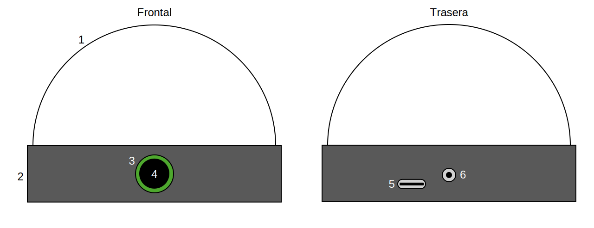

# Starlight

*para Blanca*

## Componentes de la lámpara

La siguiente figura muestra los componentes de la lámpara

1. Tulipa
2. Base
3. Led del botón
4. Botón
5. Puerto USB-c
6. Entrada de alimentación 5V

## Manual de uso

Para encender la lámpara, simplemente conéctala a la corriente mediante un adaptador DC de 5V (y preferentemente hasta 3A mínimo). La lámpara recuperará la última configuración y se encenderá en el modo por defecto.

En el modo por defecto el led del botón (3) se encuentra apagado en todo momento, y cada pulsación corta en el botón permite cambiar el tipo espectral de la estrella. Cuenta con los siguientes tipos espectrales según el *sistema Harvard*, de la astrónoma Annie Jump Cannon.

| Tipo espectral | Color |
| - | - |
| O | Azul |
| B | Blanco azulado |
| A | Blanco |
| F | Blanco amarillento |
| G | Amarillo |
| K | Naranja |
| M | Rojo |
| Enana negra | Apagado |

Una pulsación larga en el botón permite entrar al **modo configuración**.

Cuando se actualice por primera vez el estado de la lámpara, trascurrirán 10s hasta que se almacene en su memoria y poder recuperarlo al encender. Esto ocurre así para evitar el desgaste excesivo por escritura de la memoria permanente ante múltiples cambios consecutivos.

#### Precauciones de seguridad

El puerto USB-c permite reprogramar la lámpara y modificar su código o sistema de archivos. No enchufes el USB-c a dispositivo (p.e., ordenador) mientras se encuentre conectado a la corriente. Esto podría causar daños en el controlador.

Luces blancas con mucha intensidad durante tiempos prolongados pueden generar un ligero calentamiento de los leds, que puede deteriorar el material de la tulipa (PLA) si se superan los 60 grados.

Ante cualquier comportamiento inesperado, contactar con Guillermo.
